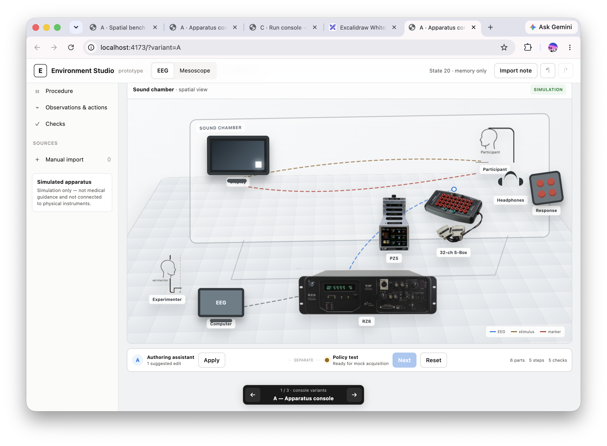

# Environments for Science

Science Environment Studio is a simulation-only prototype for authoring, running,
evaluating, and improving AI agents on scientific procedures. The first implemented
Environments model scalp electroencephalography (EEG) and a sealed synthetic mesoscope
handoff. The project doesn't connect to or control physical apparatus.



## Project status

The product, domain, interface, runtime, evaluation, and training decisions are complete.
Implementation has started on the first of 13 dependency-ordered tickets. No ticket is
complete, and the product isn't runnable end to end.

Read these documents before you implement a ticket:

1. [`CONTEXT.md`](CONTEXT.md) defines the canonical domain language.
2. [`docs/specification.md`](docs/specification.md) defines the executable product and
   its test requirements.
3. [`docs/implementation/README.md`](docs/implementation/README.md) tracks the build
   order and implementation checkpoint.
4. [`docs/product-decision-map.md`](docs/product-decision-map.md) links the resolved
   product decisions and supporting research.
5. [`DESIGN.md`](DESIGN.md) supplies visual tokens. It doesn't define the page layout.

The next implementation target is
[ticket 01: Run and replay one EEG marker-recovery episode](docs/implementation/issues/01-run-and-replay-one-eeg-marker-recovery-episode.md).

## Implementation checkpoint

The repository contains the following partial ticket 01 work:

- An extensible Environment Bundle v1 validator in `studio/bundle.py`.
- A seeded synthetic EEG marker-recovery bundle in `environments/eeg/bundle.json`.
- Runtime-level bundle validation tests in `tests/runtime/`.
- A React and TypeScript Scientist Console shell in `console/`.
- A browser test that mocks the planned public HTTP boundary.
- A disposable Gemma training-path probe in `probes/gemma-training-path/`.

The Python runtime, HTTP endpoints, deterministic episode state machine, verifier,
canonical trace, reset, and replay behavior still need implementation. The browser test
doesn't prove those behaviors because it uses mocked HTTP responses.

## Set up a development checkout

The Python package requires Python 3.9 or later. The console requires Node.js and npm.

1. Create the Python environment and install the development dependencies:

   ```bash
   python3 -m venv .venv
   .venv/bin/python -m pip install -e ".[dev]"
   ```

2. Install the console dependencies:

   ```bash
   cd console
   npm ci
   cd ..
   ```

3. Optional: Install Chromium for the Playwright browser test:

   ```bash
   cd console
   npx playwright install chromium
   cd ..
   ```

## Run the available checks

Run the Python checks from the repository root:

```bash
.venv/bin/python -m pytest
.venv/bin/ruff check studio environments tests
.venv/bin/mypy studio environments
```

Run the console checks from the `console/` directory:

```bash
npm run build
npm run test:browser
```

The browser test starts Vite and mocks the runtime API. A clean checkout doesn't provide
a complete product start command until ticket 01 implements the local runtime.

## Repository layout

- `console/`: React and TypeScript Scientist Console.
- `studio/`: Product-owned Python contract and runtime code.
- `environments/`: Authored bundles and apparatus-specific Environment modules.
- `tests/`: Runtime and integration tests.
- `docs/implementation/`: Dependency-ordered implementation tickets.
- `docs/decisions/` and `docs/adr/`: Resolved product and architecture decisions.
- `docs/research*`: Scientific, model, serving, and provider research.
- `probes/`: Disposable integration probes that aren't product runtime code.
- `prototypes/`: Rejected or throwaway interaction prototypes retained as decision
  records.

## Safety and repository boundaries

Keep credentials in environment variables and local `.env` files. Don't commit model
artifacts, generated traces, private host details, SSH material, or workstation
credentials. Training and inference run only on the approved remote GPU workstations;
the local computer is an orchestration and interface host.
