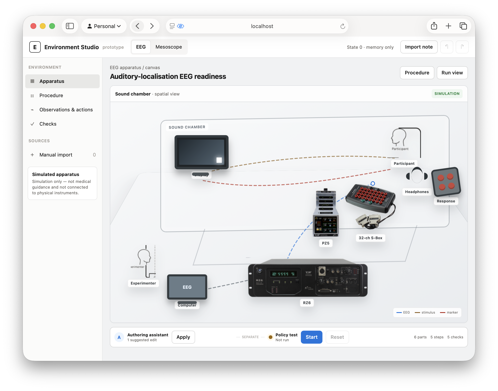

# Environments for Science

Science Environment Studio is a simulation-only prototype for authoring, running,
evaluating, and improving AI agents on scientific procedures. The first implemented
Environments model scalp electroencephalography (EEG) and a sealed synthetic mesoscope
handoff. The project doesn't connect to or control physical apparatus.



## Project status

The product, domain, interface, runtime, evaluation, and training decisions are complete.
Tickets 01 through 10 of 13 are complete. The bounded E4B adapter has passed real optimization,
private transfer, independent fresh reload on a second approved workstation, and product-owned
artifact verification. Tickets 11–13 remain in progress: the corrected immutable curriculum run,
real held-out comparison import, full suites, and final review are still required.

Read these documents before you implement a ticket:

1. [`CONTEXT.md`](CONTEXT.md) defines the canonical domain language.
2. [`docs/specification.md`](docs/specification.md) defines the executable product and
   its test requirements.
3. [`docs/implementation/README.md`](docs/implementation/README.md) tracks the build
   order and implementation checkpoint.
4. [`docs/product-decision-map.md`](docs/product-decision-map.md) links the resolved
   product decisions and supporting research.
5. [`DESIGN.md`](DESIGN.md) supplies visual tokens. It doesn't define the page layout.

The active implementation frontier is tracked in
[`docs/implementation/README.md`](docs/implementation/README.md); fixture or log-only evidence
never closes a real training or comparison ticket.

## Implementation checkpoint

The implemented and in-progress product provides:

- An extensible Environment Bundle v1 validator with nested JSON Schema checks.
- A seeded synthetic EEG marker-recovery bundle and apparatus module.
- A deterministic Environment Runtime with immutable revisions, verification, reset, and
  true replay.
- A strict local HTTP adapter and append-only caller-visible JSONL trace journal.
- A quiet React and TypeScript Scientist Console with a visualization-first EEG workflow.
- A configurable schematic whole-cap Apparatus and a distinct Procedure-selected Montage.
- Bounded conversational authoring, reversible persistent drafts, and unverified note staging.
- Content-addressed frozen revisions with explicit Authoring-assistant/Policy-agent isolation.
- Durable frozen/run indexes, full-trace bindings, cross-process serialization, and
  crash-consistent prepared-intent recovery.
- Runtime, HTTP, and real-backend browser coverage for positive and negative paths.
- Deterministic synthetic multichannel traces, compact Montage context, on-demand frequency
  measurements, and aligned onset, response, and recording evidence.
- Opaque singleton diagnostic cases, a constant typed action catalog, stale-evidence
  invalidation, evidence-bound aborts, behavioral Verifier classifications, and reviewed
  golden replay traces.
- A staged full-episode EEG curriculum spanning preflight, short acquisition, runtime
  recovery, annotation, valid close, and evidence-based abort.
- Content-addressed 96/32/64 training, development, and evaluator-held-out manifests with
  disjoint opaque identities and reserved compositional challenges.
- Trace-derived diagnostic reports with exact terminal success, safe-abort precision and
  recall, scientific strata, and sealed write-once scenario/rollout/model-configuration
  attempt ledgers that preserve failed held-out slots across restarts.
- A training-only wheel proven free of held-out resources, identities, canonical records,
  seeds, evaluator code, and reserved fault compositions.
- A catalog-driven second Environment for a sealed synthetic mesoscope R1–R4 handoff,
  sharing the EEG bundle, lifecycle, canonical trace, reset, replay, and Verifier contracts.
- Immutable profile, signed-plan, and safety-gate presentation; deterministic procedural
  region tiles; and progressive channel, frame, event, motion, manifest, and checksum evidence.
- Eight reviewed package scenarios, sealed empty-input actions, quarantine/reject-only invalid
  disposition, and exact `MOCK PACKAGE VERIFIED` success after complete agreement.
- Structurally quarantined minor-version metadata: finite namespaced JSON remains in the raw
  content-addressed bundle while reviewed runtime and presentation projections exclude it.
- Desktop and mobile browser coverage that permanently labels the handoff synthetic, sealed,
  disconnected from hardware, and free of physical or operational controls.

The repository also provides:

- A deterministic Environment-to-Verifiers compiler reused unchanged for EEG and a separate
  mesoscope platform-generality track.
- Native, storage-disabled OpenAI Responses and Gemini Interactions reference adapters with
  explicit missing-credential readiness and seeded fixtures.
- Durable bounded-acceptance and full-curriculum training jobs that coordinate only approved GPU
  workstations and never start model compute on the local computer.
- Fail-closed native artifact import, immutable held-out ledgers, paired bootstrap analysis, and
  a four-model console with explicit provider, adapter, and scientific failure states.
- Five labeled offline comparison states, constituent replay receipts, and a central demo reset
  that preserves immutable real artifacts.

The repository retains the disposable Gemma training-path probe under
`probes/gemma-training-path/`; it is not product runtime code.

## Set up a development checkout

The Python package requires Python 3.9 or later. The console requires Node.js and npm.

1. Create the Python environment and install the development dependencies:

   ```bash
   python3 -m venv .venv
   .venv/bin/python -m pip install -e ".[dev]"
   ```

2. Optional: Install Chromium for the Playwright browser test:

   ```bash
   cd console
   npm ci --ignore-scripts
   npx playwright install chromium
   cd ..
   ```

## Run the current product

From a clean checkout with `uv`, Node.js, and npm available, one command installs the locked
Python and Console dependencies, builds the Scientist Console, and starts it with the deterministic
Runtime:

```bash
uv run --all-extras python -m studio
```

An already prepared development environment can equivalently run
`.venv/bin/python -m studio`. The startup command uses `npm ci --ignore-scripts` only when
`console/node_modules` is absent, then executes the lockfile-bound build.

The command reports whether optional OpenAI and Gemini credentials are configured and always
states that Gemma compute is workstation-only. Missing hosted credentials do not block the seeded
offline demo and no credential value is printed.

Open `http://127.0.0.1:8000`. The application binds only to loopback and exposes synthetic
actions only. The persistent draft and frozen/run indexes are stored in
`artifacts/draft-workspace.sqlite3` and `artifacts/studio-index.sqlite3`. Each run writes an
append-only caller-visible trace under `artifacts/traces/`; generated artifacts are ignored
by Git.

## Run the available checks

Run the Python checks from the repository root:

```bash
.venv/bin/python -m pytest
.venv/bin/ruff check .
.venv/bin/mypy
```

Run the console checks from the `console/` directory:

```bash
npm run build
npm run test:browser
```

The browser suite starts the same loopback-only product command and exercises the real
Runtime API; it does not mock HTTP responses.

## Repository layout

- `console/`: React and TypeScript Scientist Console.
- `studio/`: Product-owned Python contract and runtime code.
- `environments/`: Authored bundles and apparatus-specific Environment modules.
- `evaluation/`: Evaluator-only held-out access, release audit, and confinement checks.
- `scripts/`: Deterministic source generators for reviewed immutable resources.
- `tests/`: Runtime and integration tests.
- `docs/implementation/`: Dependency-ordered implementation tickets.
- `docs/decisions/` and `docs/adr/`: Resolved product and architecture decisions.
- `docs/research*`: Scientific, model, serving, and provider research.
- `probes/`: Disposable integration probes that aren't product runtime code.
- `prototypes/`: Rejected or throwaway interaction prototypes retained as decision
  records.

## Safety and repository boundaries

Keep credentials in environment variables and local `.env` files. Don't commit model
artifacts, generated traces, private host details, SSH material, or workstation
credentials. Training and inference run only on the approved remote GPU workstations;
the local computer is an orchestration and interface host.
